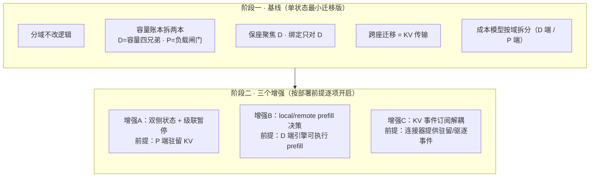
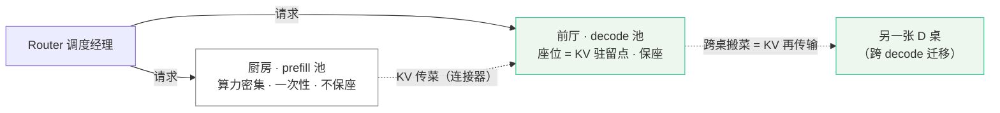
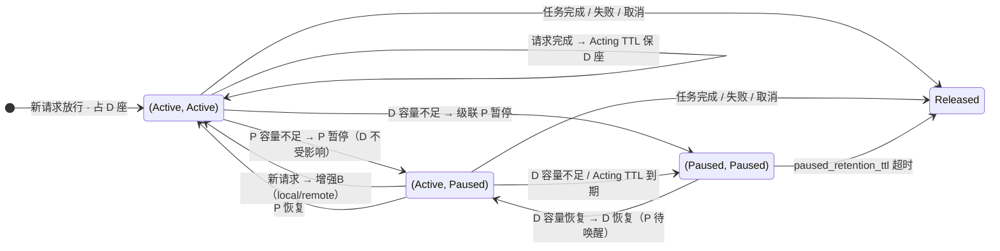

# PD 分离场景下 Program 调度的方案设计

> **结论一句话**：把 Program 调度从「一台 vLLM 机 = 一个座位」迁移到「prefill 池 + decode 池」两个资源域——**保座只做在 decode 座位上，prefill 是一次性消费、不保座**。复杂度不一次上齐：先跑通单状态最小迁移版，再按部署前提逐项开启三个增强（**双侧状态、local/remote 决策、KV 订阅解耦**）；每个增强都对应一个明确的部署前提，前提不满足就用基线，语义不残缺。
>
> **状态**：[PR #286](https://github.com/vllm-project/router/pull/286) 已合入上游 vllm-project/router；后续开发在 `/Users/ltw/Documents/infer/router` 的 `develop` 分支进行。本文是在其之上开展的 PD 分离扩展方案设计，正文中的代码链接指向 `develop` 分支当前状态。

---

## 1. 背景

[PR #286](https://github.com/vllm-project/router/pull/286)（对应 [issue #285 RFC](https://github.com/vllm-project/router/issues/285)）引入的 Program 调度解决的是：Agent 一次「LLM → 工具调用 → LLM」的连续交互中，工具调用间隙 KV 缓存被 LRU 驱逐，导致回来时整段冷 prefill。它的做法是以 Program（顾客）为单位管理「座位」= KV 缓存槽，用状态机决定保座/让座：

- [domain.rs](file:///Users/ltw/Documents/infer/router/src/program_scheduling/domain.rs#L12-L17) `ProgramState`：Active（有座，可放行）/ Paused（无座，等叫号）
- [domain.rs](file:///Users/ltw/Documents/infer/router/src/program_scheduling/domain.rs#L21-L24) `ProgramStatus`：Reasoning（有请求在飞）/ Acting（请求间隙，如工具调用中）
- [domain.rs](file:///Users/ltw/Documents/infer/router/src/program_scheduling/domain.rs#L74-L81) `ProgramTarget`：当前只有 `id` / `base_url` / `dp_rank`，是后续加 `role` 的扩展点

进入生产环境后要回答的问题：**PD 分离（prefill/decode 分开部署）之后，KV 缓存不在「一台机」里了，座位在哪？保座保谁？跨座迁移变成什么？** 本文回答这些问题。

---

## 2. 结论先行：基线 + 三个增强

完整方案的形态是「**基线（单状态最小迁移版）** + **三个增强**」。增强多出来的复杂度，每一项都对应一个部署前提：

| 增强 | 增加什么 | 部署前提 | 前提不满足时 |
|---|---|---|---|
| A 双侧状态 | P、D 各自维护 Active/Paused + 级联暂停 | P 端真的会驻留 KV（有复用收益） | 用单状态：P 是瞬时服务，随请求来去，不需要状态位 |
| B local/remote 决策 | 每次 prefill 在「D 端本地做」与「转发 P 端做」之间按成本取 min | D 端引擎允许执行 prefill | 一律 remote prefill（转发 P），无需决策 |
| C KV 订阅解耦 | 把「是否放行」与「KV 是否驻留」两个语义拆开 | KV 连接器（Nixl / Mooncake / LMCache）能提供驻留/驱逐事件 | 用请求完成事件近似 cache 驻留，基线够用 |

**节奏：先单状态跑通，再按需升级。** 阶段一交付基线的可运行版本；阶段二按部署前提逐个打开增强开关。每个增强做成独立开关（feature flag），互不依赖，可单独回滚。

---

## 3. 资源模型：从「一台机」到「两个域」

沿用餐厅比喻（与本仓库 [docs/program_scheduling.md](file:///Users/ltw/Documents/infer/router/docs/program_scheduling.md) 一脉相承）：

| 单机时代（PR #286 原语义） | PD 分离后 |
|---|---|
| 一台 vLLM 机 = 一家餐厅（备菜 + 上菜一体） | **prefill 池 = 厨房**（备菜，算力密集，一次性） |
| Program = 顾客 | **decode 池 = 前厅**（上菜，KV 驻留点 = Program 的座位） |
| 座位 = KV 缓存槽 | 座位只在 decode 池存在 |
| 跨机迁移 = 换一家餐厅 | 跨 decode 迁移 = 把菜（KV）打包搬到另一桌（连接器传输） |

**核心洞察：资源单位从「一台带 KV 座的机」拆成两个域。** Program 的「座位」这个概念只属于 decode 域：KV 驻留在哪张 D 桌，Program 就坐在哪张 D 桌。prefill 域没有座位——厨房做完菜就翻台，不占资源等下一道菜。

由此导出阶段一基线的全部设计：容量账本拆两本、保座聚焦 D、绑定只对 D、跨座迁移成本 = KV 传输。

---

## 4. 阶段一：单状态最小迁移版（先跑通）

### 4.1 原则

改动最小、逻辑等价：**不引入新状态位、不改准入公式、不改 TTL 模型**，只把「一个资源域」改成「两个资源域」的记账与路由。阶段一内部再分三步走：

1. **分域不改逻辑**：类型层把 P/D 分开，调度逻辑一行不动，验证等价；
2. **分量加闸门**：容量账本拆成 decode 四兄弟 + prefill 负载闸门；
3. **调成本模型**：TTL 的 cache-miss 成本按域重估。

### 4.2 类级改动清单

| # | 位置 | 改动 | 说明 |
|---|---|---|---|
| 1 | [domain.rs](file:///Users/ltw/Documents/infer/router/src/program_scheduling/domain.rs#L74-L81) `ProgramTarget` | 加 `role: TargetRole`（`Prefill` / `Decode`） | 现有 `id` / `base_url` / `dp_rank` 不变；`dp_rank` 仍标识 D 桌内部数据并行位，role 只用于分域 |
| 2 | 调度状态注册表 | `targets` 按域拆分（`prefill_targets` / `decode_targets`） | 复用现有 [pd_router.rs](file:///Users/ltw/Documents/infer/router/src/routers/http/pd_router.rs#L131) 的 `get_prefill_worker_urls()` / `get_decode_worker_urls()` 注册表 |
| 3 | 调度决策结构 | `ProgramDecisionState` 加 `prefill_target`（上次 prefill 落在哪个 P 实例） | 配合原生 label（工牌）识别，见 [docs/program_scheduling.md](file:///Users/ltw/Documents/infer/router/docs/program_scheduling.md) 的启用配置 |
| 4 | router 转发层 | 转发按域路由：请求先送 P（或 D 内嵌 prefill），decode 阶段只送 D | 参照 [pd_router.rs](file:///Users/ltw/Documents/infer/router/src/routers/http/pd_router.rs#L270-L300) 的 `add_prefill_server` / `add_decode_server` 分流 |
| 5 | 绑定策略 | `binding_strategy` 只对 decode 座位生效 | Program 出生时绑定 D 桌；P 不绑定、用完即弃 |
| 6 | 观测器 | 观测按域拆分（P 池吞吐、D 池吞吐分开统计） | 现有单机口径不动，加域标签即可 |

### 4.3 容量账本拆分

- **decode 域**：沿用容量四兄弟，准入公式一字不改（[scheduler_admission.rs](file:///Users/ltw/Documents/infer/router/src/program_scheduling/scheduler_admission.rs#L488-L630) `rank_admission_plan`）：

  `used（活动占用）+ required（候选需求）+ reserve（连续增长储备）<= low_watermark（总 KV 容量）`

- **prefill 域**：不再是保座资源，改为**负载闸门**（并发上限 / 队列深度）。准入放行前额外检查 P 池「现在接得住」；P 忙则请求先在等位厅（RequestPool）排队，但 Program 座位仍留在 D，不丢。

### 4.4 保座语义

- Acting TTL 保座（[scheduler_lifecycle.rs](file:///Users/ltw/Documents/infer/router/src/program_scheduling/scheduler_lifecycle.rs#L363) `expire_acting_ttls`）**只作用于 decode 座位**：请求完成进入工具调用间隙时，Program 的 D 桌保留，等回来直接续上 KV。
- 容量修复（[scheduler_lifecycle.rs](file:///Users/ltw/Documents/infer/router/src/program_scheduling/scheduler_lifecycle.rs#L519) `repair_capacity`）也只对 D 桌动手：挑「坐得久 / 占菜多」的受害者暂停其 D 座位；in-flight 只打 `pause_when_idle` 标记、不打断。
- 暂停保留期（`paused_retention_ttl`，默认 1800s，[scheduler_lifecycle.rs](file:///Users/ltw/Documents/infer/router/src/program_scheduling/scheduler_lifecycle.rs#L412) `release_expired_paused`）语义不变。

### 4.5 跨座迁移

- 原语义：跨 Rank 迁移 = 去另一台机（[scheduler_global.rs](file:///Users/ltw/Documents/infer/router/src/program_scheduling/scheduler_global.rs#L13) `schedule_global_waiting`），成本是初始化/加载。
- PD 语义：跨 decode 座位迁移 = **把 KV 通过连接器搬到另一张 D 桌**，成本变成 KV 传输（字节量 / 连接器带宽）。
- 阶段一用固定估算值（平均上下文 token × 每 token KV 字节数），阶段三再接入真实观测。全局队列的「先本机恢复、跨座要过容量 + headroom 闸门」逻辑不动。

### 4.6 观测与成本模型按域拆分

仓库已为单机 DP 口径内置 `prefill_cost_model` / `decode_throughput_model`（[scheduler_state.rs](file:///Users/ltw/Documents/infer/router/src/program_scheduling/scheduler_state.rs#L115-L116)）。阶段一要做的：把 TTL 的 cache-miss 成本拆成两段——

- **D 端成本**：回来时若要在 D 端补 prefill，拖累的是同桌其他 decode 请求；
- **P 端成本**：若转发 P 重做 prefill，拖累的是并发的其他 prefill 请求。

阶段一先各用一个固定系数（与单机共用同一模型），阶段三再分别校准。

### 4.7 等价性验证

**验证手段：P、D 部署在同一台机（单机 PD 分离），退化为单机场景，新旧行为必须一致**（准入 / 保座 / 释放的决策路径零差异）。这是「分域不改逻辑」的守门测试——分域阶段出现任何行为漂移都是 bug。

---

## 5. 阶段二：按需升级（三个增强）

### 5.1 增强 A：双侧状态 + 级联暂停（前提：P 端驻留 KV）

**前提解释**：只有当 P 端真的会保留 KV（例如 LMCache 在 P 侧做聚合/复用、或 P 的 prefix cache 命中收益明显）时，P 才需要自己的 Active/Paused 状态位；否则 P 是瞬时服务，随请求来去，单状态就够。

升级内容：

- `ProgramState` 复制成两份：`d_state`（decode 侧）/ `p_state`（prefill 侧），各自 Active/Paused。`ProgramStatus`（Reasoning/Acting）仍全局一份，不加倍。
- **级联暂停规则**（对齐用户原方案）：
  - D 因容量 pause → P 也 pause（decode 都放不下了，prefill 做了也没意义）；
  - P 因容量 pause → D 不受影响（D 桌已有 KV，还能继续上菜）。
- 调度仍以 D 为中心：**D 有座才放行**，P 的暂停/恢复由 D 侧的决策顺带驱动，不单独调度。

### 5.2 增强 B：local/remote prefill 决策（前提：D 端引擎允许执行 prefill）

**前提解释**：默认生产形态是「prefill 只在 P 做」，D 是纯 decode 引擎。只有确认 D 端能执行 prefill（如单机 PD 分离里 D 兼做小 prefill）时，才需要这个决策位；否则一律转发 P，决策是空转。

升级内容（决策矩阵，对齐用户原方案）：

| (D, P) 状态 | 新请求来时的选择 |
|---|---|
| D、P 都 active | 直接转发 P（remote），默认通信成本很低，不做比较 |
| D active、P paused | 二选一取 min：**local**（D 端补 prefill，总延迟影响 = 拖累其他 decode 请求）vs **remote**（转发 P，总延迟影响 = P 的容量与处理吞吐 + KV 传输） |
| D、P 都 paused | 等待 resume（进全局队列），不做决策 |

### 5.3 增强 C：KV 事件订阅解耦（前提：KV 连接器提供驻留/驱逐事件）

**前提解释**：当前 `active/pause` 一个状态位背着两个语义——「调度侧是否该放行」和「cache 是否仍驻留在 P/D 端」。默认部署里 cache 驻留信息只能靠请求完成事件**近似**；只有连接器（Nixl / Mooncake / LMCache）暴露了真实的 KV 驻留/驱逐事件，才值得拆开。

升级内容：

- 调度语义（是否放行）：保留在调度器状态位上；
- 驻留语义（KV 在 P 还是 D、有没有被驱逐）：**剥离出来，由 KV 事件订阅维护**；
- 收益：cache 驱逐事件一到，立即触发状态修正（如 D 桌 KV 被换走 → 标记需要重新 prefill），不再等下一次请求完成去发现。

---

## 6. 融合后的状态机迁移表（D × P 双侧）

可达状态只有 3 个 + 终态。**（D 侧 pause 时 P 必 pause，故 `(Paused, Active)` 不可达）**：

| 当前 (D, P) | 事件 | 动作 | 迁移目标 |
|---|---|---|---|
| (Active, Active) | 新请求，D 有容量 | 放行，占 D 座 | 保持 |
| (Active, Active) | 请求完成，无在飞请求 | Acting TTL 计时，保 D 座 | 保持 |
| (Active, Active) | D 容量不足 | D→Paused，**级联 P→Paused** | (Paused, Paused) |
| (Active, Active) | P 容量不足 | P→Paused（D 不受影响） | (Active, Paused) |
| (Active, Paused) | D 容量不足 | D→Paused | (Paused, Paused) |
| (Active, Paused) | 新请求 | 增强 B 决策：local（D 端 prefill）或 remote（唤醒 P） | (Active, Active) |
| (Active, Paused) | Acting TTL 到期 | D→Paused（P 已停，不再续座） | (Paused, Paused) |
| (Paused, Paused) | D 容量恢复（水位回落） | D→Active（P 待决策顺带唤醒） | (Active, Paused) |
| (Paused, Paused) | 新请求 | 等待 resume（全局队列） | 保持 |
| (Paused, Paused) | `paused_retention_ttl` 超时 | 释放 | Released |
| 任意 | 任务结束 / 请求失败 / 排队取消 | 释放 | Released |

对照原 PR 的 8 类迁移：

1. 请求完成 → 保座（保的是 **D 座**）；
2. TTL 到期 / 容量修复 / 轮数上限 / 失败 → 暂停（D 暂停，P 按级联规则联动，[scheduler_fairness.rs](file:///Users/ltw/Documents/infer/router/src/program_scheduling/scheduler_fairness.rs#L208) `yield_completed_segment` 语义不变）；
3. 新请求 → 进队；
4. 有容量 → 准入 / 恢复（**D 优先恢复**）；
5. 同 Program 新请求 → 不换座（D 座不变）；
6. 排队取消 → 释放；
7. 保留期超时 → 释放；
8. 任务结束 → 释放。

**全部对应，无新增状态种类**——只是把「座位」这个词落到 decode 域，P 域只有负载闸门、没有状态位。

---

## 7. 验证与验收

| 阶段 | 验证手段 | 通过标准 |
|---|---|---|
| 阶段一 | 单机 PD 分离等价性测试 | 新旧调度决策路径零差异 |
| 阶段一 | 双域部署冒烟 | P 池负载闸门生效、请求正确走 P→D 链路 |
| 阶段一 | 指标对比 | prompt cache 命中率、ITL、goodput 不低于单机基线（沿用 PR #286 观测口径） |
| 阶段二-A | 级联暂停压测 | D 打满时 P 同步停；P 打满时 D 继续、命中率不降 |
| 阶段二-B | 决策位开关对照 | local/remote 切换后延迟、成本符合 min 模型 |
| 阶段二-C | 驱逐事件注入 | 模拟 KV 驱逐后状态即时修正，不等下一次请求完成 |

---

## 8. 风险与开放问题

1. **KV 传输成本模型精度**：跨 D 迁移成本依赖连接器带宽的真实数据，阶段三需要接入观测。
2. **D 端 prefill 支持确认**：增强 B 的前提需要引擎侧确认；不确定时保持 remote-only。
3. **事件订阅可用性**：增强 C 依赖连接器 API；Nixl / Mooncake / LMCache 的驻留事件能力需要提前验证。
4. **双侧状态的一致性**：增强 A 里 P/D 状态由两个来源驱动，需明确权威位——**以 D 为准**。

---

## 附录：名词对照（餐厅 ↔ 技术）

| 餐厅 | 技术 |
|---|---|
| 厨房（prefill 池） | 算力密集的 prefill 实例，一次性服务，不保座 |
| 前厅（decode 池） | KV 驻留的 decode 实例，Program 的座位所在 |
| 顾客（Program） | 一次 Agent 连续交互（LLM → 工具 → LLM） |
| 座位 | decode 侧 KV 缓存槽（容量四兄弟的记账对象） |
| 保座 | Acting TTL / `paused_retention_ttl` 保护 KV 不被驱逐 |
| 让座 | 容量水位修复，暂停占座最久的 Program |
| 跨桌搬菜 | 跨 decode 座位迁移 = 连接器传输 KV |
| 传菜 | KV 连接器（Nixl / Mooncake / LMCache） |

---

## 附录 C：借鉴的参考 issue（warriorsniu/AgentInfer 系列）

以下 issue 来自私仓 [warriorsniu/AgentInfer](https://github.com/warriorsniu/AgentInfer)，是上述方案设计与本文结论形成过程中直接参考的材料。按与本文 PD 分离方案的关联度排序。

| issue | 标题（简称） | 与本文 PD 方案的借鉴点 |
|---|---|---|
| [#15](https://github.com/warriorsniu/AgentInfer/issues/15) | [PD 多轮 KV 传输与 Internal DP 缓存边界源码分析](https://github.com/warriorsniu/AgentInfer/issues/15) | 直接支撑 §3 资源模型与 §4.5：NIXL（双向、`conversation_id` 跨轮复用）vs Mooncake（单向 P→D，`kv_both` 只是能力非多轮策略）的 KV 方向与控制面差异，对应"传菜"与"跨 D 迁移＝连接器传输 KV"。 |
| [#17](https://github.com/warriorsniu/AgentInfer/issues/17) | [PD 分离 Router 与调度优化工作调研](https://github.com/warriorsniu/AgentInfer/issues/17) | 提供 §1 背景与增强 B 的决策模型来源：PD Router 四层决策（是否分离 / 选 P / 选 D / 选 P–D 路径）与"P/D 应联合选择而非顺序选择"；PPD / AMPD / ConServe 等直系 baseline，以及 Program-aware 联合路由的问题表述。 |
| [#18](https://github.com/warriorsniu/AgentInfer/issues/18) | [DP4 Consistent Hash 与 Agent-aware 复现实验](https://github.com/warriorsniu/AgentInfer/issues/18) | Router 路由的真实工程教训，对照 §4.3/§4.4 与 §8：① 生命周期 release 语义——`expected_resume` 只是 Hint，不能当"已终止"，保座/撤座必须由 end-turn 生命周期驱动（对应"保座"章节）；② 容量口径 bug——`shared_prefix_tokens` 重复扣除导致超卖准入、双层排队（对应"容量账本"章节）。 |
| [#9](https://github.com/warriorsniu/AgentInfer/issues/9) | [Progress-TTL（PT）调度器方案](https://github.com/warriorsniu/AgentInfer/issues/9) | 本文 Program 状态机（Active/Paused、Reasoning/Acting）与保座语义的理论基础：TTL / 进度 / 公平 / 容量感知五个需求来源，对应 §4.4 保座与 §6 状态机迁移。 |
| [#14](https://github.com/warriorsniu/AgentInfer/issues/14) | [TTL 收益模型与 alpha 旋钮](https://github.com/warriorsniu/AgentInfer/issues/14) | 对应 §4.6 成本模型拆分：`C = prefill秒×(2−alpha)` 的 cache-miss 代价模型、`ttl_decode_throughput_alpha` 的调参依据，可复用于 D/P 端成本的按域重估。 |
| [#13](https://github.com/warriorsniu/AgentInfer/issues/13) | [异步 Eager KV Offload 与阻塞条件分析](https://github.com/warriorsniu/AgentInfer/issues/13) | 支撑 §4.5 跨座迁移成本与 §8 风险：HBM→DRAM→SSD 三级缓存卸载的带宽余量与 safety-fence 阻塞条件，决定"跨 D 迁移成本＝KV 传输"的具体量级。 |
| [#16](https://github.com/warriorsniu/AgentInfer/issues/16) | [调度观测入口与引擎、Router 供给方式](https://github.com/warriorsniu/AgentInfer/issues/16) | 对应 §4.6 观测器与各增强的部署前提：把"观测从哪来、由引擎还是 Router 提供"定义成接口契约，强调"只报事实、决策留调度器"，与增强 C（KV 事件订阅解耦）直接衔接。 |
| [#11](https://github.com/warriorsniu/AgentInfer/issues/11) | [容量极限附近 prefix-cache 命中行为](https://github.com/warriorsniu/AgentInfer/issues/11) | 对应 §4.3 容量账本与 §7 验证：接近 KV 容量极限时混架构模型的命中率骤降、以及 vLLM 日志容量高估问题，提醒容量口径与命中率观测的坑。 |
| [#12](https://github.com/warriorsniu/AgentInfer/issues/12) | [长上下文 prefill 为什么贵](https://github.com/warriorsniu/AgentInfer/issues/12) | 支撑 §4.6 `prefill_cost_model` 拆分：prefill 为 O(L²) 而 decode 为 O(L)，解释"D 端补 prefill 拖累同桌 / P 端重做拖累并发 prefill"两种成本为何需分域计量。 |
